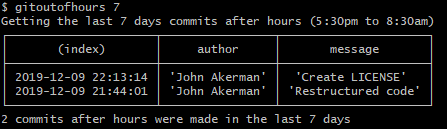

<h1 align="center">Git Out Of Hours</h1>

> View commit information on out of hours commits on a repo
<p align="center">
<a href="https://www.npmjs.com/package/gitoutofhours" target="_blank"></a>

<a href="https://github.com/JohnAkerman/GitOutOfHours/blob/master/LICENSE"></a>


  <a href="https://snyk.io/test/github/JohnAkerman/GitOutOfHours"></a>
</p>


## Install 
*Globally (recommended)*
```
$ npm i -g gitoutofhours
```

## Usage
After you've installed `gitoutofhours` globally you will be able to run it as a CLI application using the command line. 
```
$ gitoutofhours [daysInPast] [author](optional, in quotes)
```


Basic usage to establish how many commits were out of hours in the past week
```
$ gitoutofhours 7
```


## Purpose
This tool can help gather information about repos where teh author commited work out of common office hours (between 5:30pm to 8:30am).
